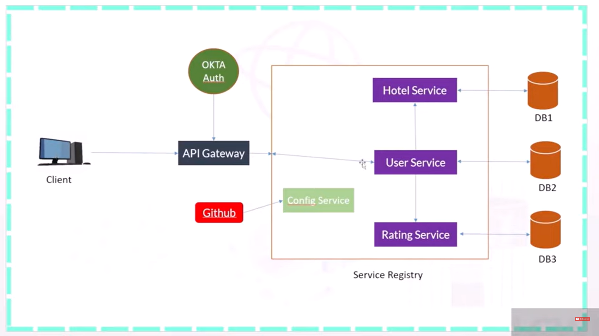

### API Gateway 
1. Here we are creating one API Gateway with the help of which we can call our microservices registered with this API Gateway.
2. To create an API Gateway we need to follow below steps -
   1. First create one simple microservice with below dependencies -
      ```
       implementation 'org.springframework.boot:spring-boot-starter-webflux'
       implementation 'org.springframework.cloud:spring-cloud-starter'
       implementation 'org.springframework.cloud:spring-cloud-starter-gateway'
       implementation 'org.springframework.cloud:spring-cloud-starter-netflix-eureka-client'
       ```
   2. We need to include the dependency of spring-cloud, webflux, sprin-cloud-gateway but here we are also including the
      dependency of eureka-client because we need to register this gateway as well to eureka client.
   3. In Spring-Boot 3 we need to provide another configuration in our API Gateway to keep our API-Gateway application UP -
   ```yaml
    spring:
      main:
        web-application-type: reactive
    ```
   4.  Now we need to configure our microservices to our gateway.
3. For Spring-cloud API Gateway follow below link -  
   https://cloud.spring.io/spring-cloud-gateway/reference/html/

4. Below is the Eureka Server where this APIGateway is configured -  
   [Eureka Server](https://github.com/ayushdgupta/SpringBoot3-Eureka-Service-Microservice)
5. Below Microservices are configured to this APIGateway -  
   1. [Hotel microservice](https://github.com/ayushdgupta/SpringBoot3-Hotel-Microservice).
   2. [User microservice](https://github.com/ayushdgupta/SpringBoot3-User-Microservice/tree/master).
   3. [Rating microservice](https://github.com/ayushdgupta/SpringBoot3-Rating-Microservice).
6. This API is using Config-server to fetch common configuration - [Config-Server](https://github.com/ayushdgupta/SpringBoot3-ConfigServer-Microservice)
7. Configurations are present on Github - [Common-Configuration](https://github.com/ayushdgupta/SpringBoot3-ConfigFiles-ConfigServer-Microservice)

### Microservice as config-client
1. To use our microservice as config client we need to add below dependency -
```groovy
implementation 'org.springframework.cloud:spring-cloud-starter-config'
```
2. Apart from that we need to add few configurations in our application.yaml file -
```yaml
spring:
  config:                             # this propes is used to connect to the config-server
    import: optional:configserver:http://localhost:9094
```
3. By Adding above two configurations our microservice will act as config-client, so now it can fetch any values
   from config files whatever required internally (eureka server props) or externally (using @Value, System.getProperty()).
4. @RefreshScope

### API-Gateway Working Flow Diagram

